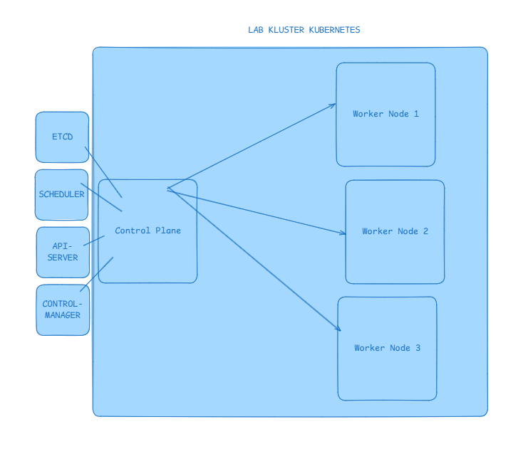

# Lab Kluster Kubernetes (1 Control-Plane + 3 Worker Nodes)

Lab kluster Kubernetes otomatis menggunakan **Vagrant** dan **Oracle VirtualBox** dengan sistem operasi Ubuntu 22.04 LTS, container runtime **containerd**, dan **kubeadm** v1.31. Seluruh disk VM diarahkan ke drive eksternal `D:\VirtualBox VMs`.

---

## 1. Tujuan Project

Project ini bertujuan menyediakan lingkungan lab Kubernetes lokal yang mudah dibuat dan dihapus untuk mempelajari arsitektur kluster, hubungan antara control plane dan worker node, serta proses deployment aplikasi pada beberapa node.



## 2. Topologi Kluster

| Node Name | Peran | IP Address | vCPU | RAM | Disk Location |
| :--- | :--- | :--- | :--- | :--- | :--- |
| `k8s-control-plane` | Control Plane | `192.168.56.10` | 2 | 2048 MB | `D:\VirtualBox VMs` |
| `k8s-worker-1` | Worker Node 1 | `192.168.56.11` | 1 | 1536 MB | `D:\VirtualBox VMs` |
| `k8s-worker-2` | Worker Node 2 | `192.168.56.12` | 1 | 1536 MB | `D:\VirtualBox VMs` |
| `k8s-worker-3` | Worker Node 3 | `192.168.56.13` | 1 | 1536 MB | `D:\VirtualBox VMs` |

- **Host-Only Network**: `192.168.56.0/24`
- **Pod Network CIDR**: `10.244.0.0/16` (Flannel CNI)
- **Container Runtime**: `containerd` (SystemdCgroup = true)

---

## 3. Prasyarat & Konfigurasi Disk Eksternal

### A. Arahkan Direktori VM VirtualBox ke Drive D:
Pastikan VirtualBox menyimpan seluruh disk dan mesin virtual baru ke `D:\VirtualBox VMs`:

**Lewat Terminal (PowerShell):**
```powershell
VBoxManage setproperty machinefolder "D:\VirtualBox VMs"
```

*Atau lewat GUI VirtualBox:*
> Buka **VirtualBox** -> Menu **File** -> **Preferences** (atau `Ctrl + G`) -> Tab **General** -> Ubah **Default Machine Folder** ke `D:\VirtualBox VMs`.

### B. Arahkan Cache Unduhan Box Vagrant ke Drive D:
Secara default, Vagrant mengunduh box ke `C:\Users\<user>\.vagrant.d`. Agar file image/box yang diunduh **tidak memakan ruang drive C:** dan tersimpan di drive D, jalankan perintah ini di PowerShell:

```powershell
[System.Environment]::SetEnvironmentVariable('VAGRANT_HOME', 'D:\.vagrant.d', 'User')
$env:VAGRANT_HOME = "D:\.vagrant.d"
```

---

## 4. Menjalankan Kluster

Buka terminal PowerShell di folder ini (`C:\Users\marti\Programming\lab-kubernetes`), lalu jalankan:

```powershell
# Jalankan seluruh kluster (Control-Plane dan semua Worker Node)
vagrant up
```

> **Catatan Proses**:
> 1. Vagrant akan mengunduh box `bento/ubuntu-22.04` (hanya saat pertama kali).
> 2. Node `k8s-control-plane` akan dibuat dan diinisialisasi terlebih dahulu. Skrip inisialisasi akan otomatis menghasilkan token join dan menyimpannya di folder `shared/join.sh`.
> 3. Node worker (`k8s-worker-1` s/d `k8s-worker-3`) akan dibuat dan otomatis membaca `shared/join.sh` untuk bergabung ke kluster tanpa intervensi manual.

---

## 5. Mengakses dan Memverifikasi Kluster

### Masuk ke Control Plane via SSH
```powershell
vagrant ssh k8s-control-plane
```

### Cek Status Node
Di dalam terminal VM control-plane:
```bash
kubectl get nodes -o wide
```
*Output yang diharapkan (semua node berstatus Ready):*
```text
NAME                STATUS   ROLES           AGE   VERSION   INTERNAL-IP
k8s-control-plane   Ready    control-plane   3m    v1.31.x   192.168.56.10
k8s-worker-1        Ready    <none>          2m    v1.31.x   192.168.56.11
k8s-worker-2        Ready    <none>          2m    v1.31.x   192.168.56.12
k8s-worker-3        Ready    <none>          1m    v1.31.x   192.168.56.13
```

### Cek Pod Komponen Sistem & CNI
```bash
kubectl get pods -n kube-system
```
Pastikan pod `kube-flannel-ds-*`, `coredns-*`, `etcd-*`, dan `kube-apiserver-*` berstatus `Running`.

### Uji Coba Deployment (Smoke Test)
```bash
# Buat deployment uji coba Nginx
kubectl create deployment test-nginx --image=nginx --replicas=3

# Pantau distribusi pod di seluruh worker node
kubectl get pods -o wide

# Bersihkan deployment uji coba
kubectl delete deployment test-nginx
```

---

## 6. Perintah Manajemen Kluster (Siklus Hidup VM)

| Perintah | Deskripsi |
| :--- | :--- |
| `vagrant status` | Memeriksa status hidup/mati seluruh node VM |
| `vagrant halt` | Mematikan (shutdown) seluruh VM kluster secara rapi |
| `vagrant up` | Menyalakan kembali seluruh VM kluster yang sebelumnya dimatikan |
| `vagrant reload` | Restart seluruh VM kluster |
| `vagrant ssh <nama-node>` | Masuk ke node tertentu (misal: `vagrant ssh k8s-worker-1`) |
| `vagrant destroy -f` | Menghapus total seluruh VM kluster dan membersihkan disk |

---

## 7. Menggunakan Kubectl dari Windows Host (Opsional)
File `kubeconfig` otomatis disalin ke folder lokal `shared/kubeconfig`.
Jika Anda memiliki `kubectl.exe` terpasang di Windows, Anda dapat berinteraksi langsung tanpa SSH:
```powershell
kubectl --kubeconfig=shared/kubeconfig get nodes
```
*(Catatan: Pastikan `k8s-control-plane` dapat diakses atau ganti server URL di kubeconfig jika diperlukan).*
